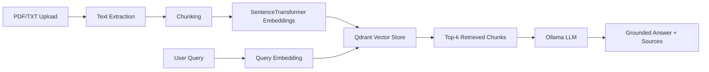

# RAG Chatbot for Lecture Notes

A FastAPI-based Retrieval-Augmented Generation (RAG) chatbot for querying lecture notes and other PDF/TXT documents. The system extracts text from uploaded files, splits the text into overlapping chunks, embeds the chunks with SentenceTransformers, stores them in Qdrant, retrieves relevant context for a user query, and generates grounded answers using a local Ollama LLM.

This project was built as a practical lecture-note assistant and includes retrieval evaluation scripts for testing chunking and top-k settings using manually prepared question-answer pairs.

## Key Features

- Upload and index PDF or TXT documents through a FastAPI endpoint
- Extract page-level text from PDFs using `pypdf`
- Split documents into overlapping chunks with configurable chunk size and overlap
- Generate normalized embeddings using SentenceTransformers
- Store and search document chunks in Qdrant using cosine similarity
- Retrieve top-k source chunks for a query, optionally filtered by document ID
- Generate grounded answers using a local Ollama model
- Return source metadata including filename, page number, source reference, similarity score, and retrieved context
- Evaluate retrieval quality using Recall@k, Mean Reciprocal Rank (MRR), and retrieval latency
- Support manual faithfulness review of generated answers

## Tech Stack

| Area | Tools |
|---|---|
| Backend API | FastAPI, Uvicorn |
| Vector database | Qdrant |
| Embeddings | SentenceTransformers |
| LLM runtime | Ollama |
| PDF parsing | pypdf |
| Evaluation | Custom Python scripts, CSV/JSONL |
| Containerization | Docker, Docker Compose |

## System Architecture



## Project Structure

```text
RAG-CHATBOT/
├── app/
│   ├── main.py                 # FastAPI routes
│   ├── config.py               # Environment-based configuration
│   ├── schemas.py              # Request schemas
│   └── services/
│       ├── document_loader.py  # PDF/TXT text extraction
│       ├── chunker.py          # Text chunking
│       ├── embedder.py         # SentenceTransformer embeddings
│       ├── vector_store.py     # Qdrant collection and search logic
│       ├── rag_pipeline.py     # Retrieval + Ollama answer generation
│       └── evaluator.py        # Retrieval evaluation metrics
├── data/
│   └── uploads/                # Local documents for tuning/evaluation
├── evaluation/
│   ├── eval_questions.jsonl    # Evaluation questions and expected source pages
│   ├── tune_retrieval.py       # Retrieval tuning script
│   ├── tuning_results.csv      # Retrieval tuning output
│   ├── run_faithfulness_eval.py
│   ├── faithfulness_review.csv
│   └── faithfulness_review_filled.csv
├── docker-compose.yml
├── Dockerfile
└── requirements.txt

```

## Prerequisites

Install the following before running the project:

- Docker and Docker Compose
- Python 3.12, if running locally without Docker
- Ollama, for local LLM generation

Pull an Ollama model before using the `/query` endpoint:

```bash
ollama pull llama3.1
```

The default Docker Compose configuration uses:

```text
OLLAMA_BASE_URL=http://host.docker.internal:11434
OLLAMA_MODEL=llama3.1
```

On Windows and macOS, `host.docker.internal` usually allows the API container to call Ollama running on the host machine. On Linux, you may need to add host-gateway configuration or run Ollama in a container on the same Docker network.

## Quick Start with Docker Compose

Start Qdrant and the FastAPI backend:

```bash
docker compose up --build
```

The API should be available at:

```text
http://localhost:8000
```

Open the interactive API documentation:

```text
http://localhost:8000/docs
```

Check that the backend is running:

```bash
curl http://localhost:8000/health
```

Expected response:

```json
{
  "status": "ok"
}
```

## Local Development Setup

Install dependencies:

```bash
pip install -r requirements.txt
```

Start Qdrant using Docker:

```bash
docker run -p 6333:6333 -v qdrant_data:/qdrant/storage qdrant/qdrant:latest
```

Start the FastAPI backend:

```bash
uvicorn app.main:app --host 0.0.0.0 --port 8000 --reload
```

## Configuration

The project reads configuration values from environment variables in `app/config.py`.

| Variable | Default | Purpose |
|---|---:|---|
| `QDRANT_HOST` | `localhost` | Qdrant hostname |
| `QDRANT_PORT` | `6333` | Qdrant port |
| `COLLECTION_NAME` | `rag_chunks` | Qdrant collection name |
| `EMBEDDING_MODEL` | `sentence-transformers/all-MiniLM-L6-v2` | SentenceTransformer model |
| `CHUNK_SIZE` | `800` | Number of characters per chunk |
| `CHUNK_OVERLAP` | `120` | Overlap between neighbouring chunks |
| `TOP_K` | `5` | Default number of retrieved chunks |
| `OLLAMA_BASE_URL` | `http://localhost:11434` | Ollama server URL |
| `OLLAMA_MODEL` | `qwen3:8b` | Ollama model name |

The Docker Compose file overrides several defaults for the containerized setup:

```yaml
CHUNK_SIZE=600
CHUNK_OVERLAP=100
TOP_K=8
OLLAMA_BASE_URL=http://host.docker.internal:11434
OLLAMA_MODEL=llama3.1
```

## API Usage

### 1. Upload and index a document

Endpoint:

```text
POST /documents/upload
```

Supported file types:

- `.pdf`
- `.txt`

Example using `curl`:

```bash
curl -X POST "http://localhost:8000/documents/upload" \
  -F "file=@data/uploads/example.pdf"
```

Example response:

```json
{
  "message": "Document uploaded and indexed successfully.",
  "doc_id": "4bb7e52e-2d5e-4b42-bbcb-42fb42e62563",
  "filename": "example.pdf",
  "chunks_indexed": 42
}
```

### 2. Retrieve relevant chunks only

Endpoint:

```text
POST /retrieve
```

Use this when you want to inspect retrieval results without calling the LLM.

Example request:

```bash
curl -X POST "http://localhost:8000/retrieve" \
  -H "Content-Type: application/json" \
  -d '{
    "query": "What are the core components of an AI agent?",
    "top_k": 5
  }'
```

Optional document filtering:

```json
{
  "query": "What are the core components of an AI agent?",
  "top_k": 5,
  "doc_id": "4bb7e52e-2d5e-4b42-bbcb-42fb42e62563"
}
```

Example response shape:

```json
{
  "query": "What are the core components of an AI agent?",
  "results": [
    {
      "score": 0.8123,
      "text": "...retrieved chunk text...",
      "filename": "example.pdf",
      "page": 10,
      "source": "example.pdf#page=10",
      "doc_id": "4bb7e52e-2d5e-4b42-bbcb-42fb42e62563",
      "chunk_index": 0
    }
  ]
}
```

### 3. Ask a question with RAG answer generation

Endpoint:

```text
POST /query
```

Example request:

```bash
curl -X POST "http://localhost:8000/query" \
  -H "Content-Type: application/json" \
  -d '{
    "query": "What are the core components of an AI agent?",
    "top_k": 8
  }'
```

Example response shape:

```json
{
  "question": "What are the core components of an AI agent?",
  "answer": "The core components include the LLM, reasoning and policy, tools, memory, planning, and reflection.",
  "sources": [
    {
      "filename": "example.pdf",
      "page": 10,
      "source": "example.pdf#page=10",
      "score": 0.8123
    }
  ],
  "retrieved_context": [
    {
      "text": "...retrieved context used by the LLM...",
      "source": "example.pdf#page=10",
      "score": 0.8123
    }
  ],
  "latency_ms": 1532.44
}
```

### 4. Evaluate retrieval quality

Endpoint:

```text
POST /evaluate/retrieval
```

This endpoint evaluates retrieval against `evaluation/eval_questions.jsonl` using the currently indexed Qdrant collection.

Example:

```bash
curl -X POST "http://localhost:8000/evaluate/retrieval"
```

Example response shape:

```json
{
  "total_answerable_questions": 95,
  "correct_retrievals": 85,
  "skipped_lines_or_unanswerable_questions": 15,
  "recall@8": 0.8947,
  "mrr": 0.6662,
  "avg_retrieval_latency_ms": 5.4,
  "json_errors": []
}
```

## Retrieval Evaluation

The repository includes a retrieval tuning script:

```bash
python evaluation/tune_retrieval.py
```

The script tests multiple chunking and top-k configurations, re-indexes the uploaded documents, evaluates retrieval against manually prepared questions, and writes results to:

```text
evaluation/tuning_results.csv
```

The best recorded configuration in the included tuning output is:

| Chunk size | Chunk overlap | Top-k | Total chunks | Answerable questions | Correct retrievals | Recall | MRR | Avg retrieval latency |
|---:|---:|---:|---:|---:|---:|---:|---:|---:|
| 600 | 100 | 8 | 552 | 95 | 85 | 0.8947 | 0.6662 | 5.40 ms |

This result suggests that retrieving more chunks improved recall compared with `top_k=5`, while using `chunk_size=600` and `chunk_overlap=100` provided a strong balance between retrieval coverage and efficiency.

## Faithfulness Review

The project also supports manual review of generated answers:

```bash
python evaluation/run_faithfulness_eval.py
```

This script sends each evaluation question to the `/query` endpoint and writes a CSV for review:

```text
evaluation/faithfulness_review.csv
```

The review file includes:

| Column | Purpose |
|---|---|
| `question` | Evaluation question |
| `expected_answer` | Reference answer |
| `expected_filename` | Expected source document |
| `expected_page` | Expected source page |
| `generated_answer` | Answer generated by the RAG pipeline |
| `retrieved_sources` | Retrieved source metadata |
| `retrieved_context` | Retrieved context shown to the LLM |
| `answer_correct` | Manual correctness label |
| `faithful` | Manual faithfulness label |
| `notes` | Reviewer comments |

Suggested labels:

- `answer_correct = 1` if the generated answer matches the expected answer sufficiently
- `answer_correct = 0` if the answer is wrong, incomplete, or misleading
- `faithful = 1` if the answer is supported by the retrieved context
- `faithful = 0` if the answer contains unsupported claims or contradicts the context

