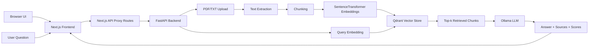

# RAG Chatbot for Lecture Notes

A full-stack Retrieval-Augmented Generation (RAG) chatbot for querying PDF/TXT documents. The system ingests documents, extracts text, chunks content, generates embeddings, stores vectors in Qdrant, retrieves relevant source chunks, and generates grounded answers using a local Ollama LLM.

The project includes:

- A **FastAPI backend** for document upload, retrieval, answering, and evaluation
- A **Qdrant vector database** for semantic search
- A **local Ollama LLM** for answer generation
- A **React/Next.js frontend** for uploading documents and chatting with the indexed content
- Evaluation scripts for retrieval accuracy, answer correctness, faithfulness, and latency

---

## Key Features

### Backend

- Upload and index PDF/TXT documents
- Extract page-level text from PDFs using `pypdf`
- Split documents into overlapping chunks
- Generate normalized embeddings using SentenceTransformers
- Store and search document chunks in Qdrant using cosine similarity
- Retrieve top-k source chunks for a query
- Generate grounded answers using Ollama
- Return source metadata, page numbers, retrieval scores, and retrieved context
- List indexed documents
- Evaluate retrieval quality using Recall@K, MRR, and latency
- Support manual faithfulness review of generated answers

### Frontend

- Upload PDF/TXT files from a browser UI
- Show indexed documents with document ID, page count, and chunk count
- Ask questions through a chat-style interface
- Display generated answers
- Show retrieved source filenames and page numbers
- Show retrieval similarity scores
- Expand source chunks used by the LLM

---

## Tech Stack

| Area | Tools |
|---|---|
| Frontend | Next.js, React, TypeScript, Tailwind CSS |
| Backend API | FastAPI, Uvicorn |
| Vector database | Qdrant |
| Embeddings | SentenceTransformers |
| LLM runtime | Ollama |
| PDF parsing | pypdf |
| Evaluation | Custom Python scripts, JSONL, CSV |
| Containerization | Docker, Docker Compose |

---

## System Architecture



---

## Project Structure

```text
rag-chatbot/
├── app/
│   ├── main.py                    # FastAPI routes
│   ├── config.py                  # Environment-based configuration
│   ├── schemas.py                 # Request schemas
│   └── services/
│       ├── document_loader.py     # PDF/TXT text extraction
│       ├── chunker.py             # Text chunking
│       ├── embedder.py            # SentenceTransformer embeddings
│       ├── vector_store.py        # Qdrant collection/search/document listing
│       ├── rag_pipeline.py        # Retrieval + Ollama answer generation
│       └── evaluator.py           # Retrieval evaluation metrics
│
├── frontend/
│   ├── app/
│   │   ├── page.tsx               # Main React UI
│   │   └── api/
│   │       ├── upload/route.ts    # Proxy to FastAPI /documents/upload
│   │       ├── documents/route.ts # Proxy to FastAPI /documents
│   │       └── query/route.ts     # Proxy to FastAPI /query
│   ├── package.json
│   └── .env.local
│
├── data/
│   └── uploads/                   # Local documents for tuning/evaluation
│
├── evaluation/
│   ├── eval_questions.jsonl       # Evaluation questions and expected answers/sources
│   ├── tune_retrieval.py          # Automated retrieval tuning script
│   ├── tuning_results.csv         # Retrieval tuning output
│   ├── run_faithfulness_eval.py   # Generates review CSV from /query outputs
│   ├── faithfulness_review.csv
│   └── faithfulness_review_filled.csv
│
├── docker-compose.yml
├── Dockerfile
├── requirements.txt
└── README.md
```

---

## Prerequisites

Install:

- Docker and Docker Compose
- Node.js 18+ for the Next.js frontend
- Ollama for local LLM generation

Pull an Ollama model:

```bash
ollama pull llama3.1:8b
```

Start Ollama if it is not already running:

```bash
ollama serve
```

The backend container calls Ollama on the host machine using:

```text
OLLAMA_BASE_URL=http://host.docker.internal:11434
```

On Windows and macOS, `host.docker.internal` usually works by default. On Linux, you may need to add host-gateway configuration or run Ollama in Docker on the same network.

---

## Quick Start

### 1. Start the backend and Qdrant

From the project root:

```bash
docker compose up --build
```

The FastAPI backend runs at:

```text
http://localhost:8000
```

FastAPI Swagger documentation:

```text
http://localhost:8000/docs
```

Qdrant dashboard:

```text
http://localhost:6333/dashboard
```

Health check:

```bash
curl http://localhost:8000/health
```

Expected response:

```json
{
  "status": "ok"
}
```

### 2. Start the frontend

In a second terminal:

```bash
cd frontend
npm install
npm run dev
```

The frontend runs at:

```text
http://localhost:3000
```

Create `frontend/.env.local` if it does not already exist:

```env
RAG_API_BASE_URL=http://localhost:8000
```

---

## Docker Compose Configuration

The backend is configured through environment variables in `docker-compose.yml`.

Recommended final retrieval settings from tuning:

```yaml
environment:
  - QDRANT_HOST=qdrant
  - QDRANT_PORT=6333
  - COLLECTION_NAME=rag_chunks
  - CHUNK_SIZE=600
  - CHUNK_OVERLAP=100
  - TOP_K=8
  - PYTHONPATH=/app
  - OLLAMA_BASE_URL=http://host.docker.internal:11434
  - OLLAMA_MODEL=llama3.1:8b
```

If you change `CHUNK_SIZE` or `CHUNK_OVERLAP`, clear Qdrant and re-upload documents because old chunks were created using the previous settings:

```bash
docker compose down -v
docker compose up --build --force-recreate
```

To verify the backend is reading the correct environment values:

```bash
docker compose exec api python -c "from app.config import CHUNK_SIZE, CHUNK_OVERLAP, TOP_K; print(CHUNK_SIZE, CHUNK_OVERLAP, TOP_K)"
```

Expected output:

```text
600 100 8
```

---

## API Endpoints

| Endpoint | Method | Purpose |
|---|---:|---|
| `/health` | GET | Check backend health |
| `/documents/upload` | POST | Upload and index a PDF/TXT document |
| `/documents` | GET | List indexed documents |
| `/retrieve` | POST | Retrieve source chunks without LLM generation |
| `/query` | POST | Retrieve context and generate an answer |
| `/evaluate/retrieval` | POST | Run retrieval evaluation |

---

## API Usage

### 1. Upload and index a document

```bash
curl -X POST "http://localhost:8000/documents/upload" \
  -F "file=@data/uploads/example.pdf"
```

Example response:

```json
{
  "message": "Document uploaded and indexed successfully.",
  "doc_id": "4bb7e52e-2d5e-4b42-bbcb-42fb42e62563",
  "filename": "example.pdf",
  "chunks_indexed": 42
}
```

### 2. List indexed documents

```bash
curl http://localhost:8000/documents
```

Example response:

```json
{
  "documents": [
    {
      "doc_id": "4bb7e52e-2d5e-4b42-bbcb-42fb42e62563",
      "filename": "example.pdf",
      "chunk_count": 42,
      "page_count": 12,
      "pages": [1, 2, 3, 4]
    }
  ]
}
```

### 3. Retrieve relevant chunks only

Use `/retrieve` to inspect semantic search results before answer generation.

```bash
curl -X POST "http://localhost:8000/retrieve" \
  -H "Content-Type: application/json" \
  -d '{
    "query": "What are the core components of an AI agent?",
    "top_k": 8
  }'
```

Optional document filtering:

```json
{
  "query": "What are the core components of an AI agent?",
  "top_k": 8,
  "doc_id": "4bb7e52e-2d5e-4b42-bbcb-42fb42e62563"
}
```

Example response shape:

```json
{
  "query": "What are the core components of an AI agent?",
  "results": [
    {
      "score": 0.8123,
      "text": "...retrieved chunk text...",
      "filename": "example.pdf",
      "page": 10,
      "source": "example.pdf#page=10",
      "doc_id": "4bb7e52e-2d5e-4b42-bbcb-42fb42e62563",
      "chunk_index": 0
    }
  ]
}
```

### 4. Ask a question with RAG answer generation

```bash
curl -X POST "http://localhost:8000/query" \
  -H "Content-Type: application/json" \
  -d '{
    "query": "What are the core components of an AI agent?",
    "top_k": 8
  }'
```

Example response shape:

```json
{
  "question": "What are the core components of an AI agent?",
  "answer": "The core components include the LLM, reasoning and policy, tools, memory, planning, and reflection.",
  "sources": [
    {
      "filename": "example.pdf",
      "page": 10,
      "source": "example.pdf#page=10",
      "score": 0.8123
    }
  ],
  "retrieved_context": [
    {
      "text": "...retrieved context used by the LLM...",
      "source": "example.pdf#page=10",
      "score": 0.8123
    }
  ],
  "latency_ms": 1532.44
}
```

### 5. Evaluate retrieval quality

```bash
curl -X POST "http://localhost:8000/evaluate/retrieval"
```

Example response from the final tuned configuration:

```json
{
  "total_answerable_questions": 95,
  "correct_retrievals": 85,
  "skipped_lines_or_unanswerable_questions": 15,
  "recall@8": 0.8947,
  "mrr": 0.6662,
  "avg_retrieval_latency_ms": 5.4,
  "json_errors": []
}
```

---

## Frontend Usage

Open:

```text
http://localhost:3000
```

The UI supports:

1. **Upload PDF/TXT**  
   Select a document and upload it to the FastAPI backend. The backend extracts text, chunks the content, embeds the chunks, and stores them in Qdrant.

2. **View indexed documents**  
   The UI calls `/documents` and displays each indexed document with its filename, document ID, page count, and chunk count.

3. **Ask a question**  
   The UI sends the question to `/query`, which performs retrieval and calls the Ollama LLM.

4. **Inspect the answer**  
   The answer is shown together with latency.

5. **Inspect sources**  
   The UI displays retrieved filenames, page numbers, source references, similarity scores, and expandable source chunk text.

---

## Retrieval Evaluation

The repository includes an automated retrieval tuning script:

```bash
docker compose exec api python evaluation/tune_retrieval.py
```

The script:

1. Tries multiple `chunk_size`, `chunk_overlap`, and `top_k` settings
2. Re-indexes documents for each configuration
3. Evaluates retrieval against `evaluation/eval_questions.jsonl`
4. Writes results to `evaluation/tuning_results.csv`

Best recorded tuning result:

| Chunk size | Chunk overlap | Top-K | Total chunks | Answerable questions | Correct retrievals | Recall | MRR | Avg retrieval latency |
|---:|---:|---:|---:|---:|---:|---:|---:|---:|
| 600 | 100 | 8 | 552 | 95 | 85 | 0.8947 | 0.6662 | 5.40 ms |

This configuration was selected because it achieved the highest recall among tested settings while avoiding unnecessary extra context compared with `top_k=10`.

---

## Faithfulness and Answer Quality Evaluation

After connecting the Ollama LLM, generated answers were reviewed manually using:

```bash
docker compose exec api python evaluation/run_faithfulness_eval.py
```

This creates:

```text
evaluation/faithfulness_review.csv
```

The review file includes:

| Column | Purpose |
|---|---|
| `question` | Evaluation question |
| `expected_answer` | Reference answer |
| `expected_filename` | Expected source document |
| `expected_page` | Expected source page |
| `generated_answer` | Answer generated by the RAG pipeline |
| `retrieved_sources` | Retrieved source metadata |
| `retrieved_context` | Retrieved context shown to the LLM |
| `answer_correct` | Manual correctness label |
| `faithful` | Manual faithfulness label |
| `notes` | Reviewer comments |

Scoring rules:

- `answer_correct = 1` if the generated answer sufficiently matches the expected answer
- `answer_correct = 0` if the answer is wrong, incomplete, or misleading
- `faithful = 1` if every factual claim is supported by the retrieved context
- `faithful = 0` if the answer contains unsupported claims or contradicts the retrieved context

Final reviewed results:

| Metric | Result |
|---|---:|
| Answer correctness | 85 / 98 = 86.73% |
| Faithfulness | 96 / 98 = 97.96% |
| Correct and faithful | 84 / 98 = 85.71% |

Interpretation:

- The high faithfulness score indicates that the LLM generally stayed grounded in the retrieved context.
- The lower correctness score indicates that remaining errors were mostly due to retrieval misses, incomplete answers, or cases where the retrieved context did not contain enough information.

---

## Current Evaluation Summary

| Component | Metric | Result |
|---|---:|---:|
| Retrieval | Recall@8 | 0.8947 |
| Retrieval | MRR | 0.6662 |
| Retrieval | Average retrieval latency | 5.40 ms |
| Answer generation | Answer correctness | 86.73% |
| Answer grounding | Faithfulness | 97.96% |
| End-to-end RAG | Correct and faithful answers | 85.71% |

---

## Troubleshooting

### FastAPI cannot import `app`

Run scripts with `PYTHONPATH=/app` inside Docker:

```bash
docker compose exec api sh -c "PYTHONPATH=/app python evaluation/tune_retrieval.py"
```

Or add this to the API service environment:

```yaml
- PYTHONPATH=/app
```

### Docker Compose values are not being used

Check the values inside the container:

```bash
docker compose exec api python -c "from app.config import CHUNK_SIZE, CHUNK_OVERLAP, TOP_K; print(CHUNK_SIZE, CHUNK_OVERLAP, TOP_K)"
```

If the output is wrong, recreate the container:

```bash
docker compose down
docker compose up --build --force-recreate
```

### Old chunks remain after changing chunk settings

Clear Qdrant and re-index:

```bash
docker compose down -v
docker compose up --build --force-recreate
```

### Ollama connection fails from Docker

Check that Ollama is running on the host:

```bash
curl http://localhost:11434/api/tags
```

Check from inside the API container:

```bash
docker compose exec api python -c "import requests; print(requests.get('http://host.docker.internal:11434/api/tags').text)"
```

If the model is missing:

```bash
ollama pull llama3.1:8b
```

### `/retrieve` or `/query` defaults to the wrong top-k

Make sure `schemas.py` imports `TOP_K` and uses it as the default:

```python
from app.config import TOP_K

class RetrieveRequest(BaseModel):
    query: str
    top_k: int = TOP_K
    doc_id: Optional[str] = None

class QueryRequest(BaseModel):
    query: str
    top_k: int = TOP_K
```

Also ensure `main.py` uses `TOP_K` for `/evaluate/retrieval` instead of a hardcoded `5`.

---

